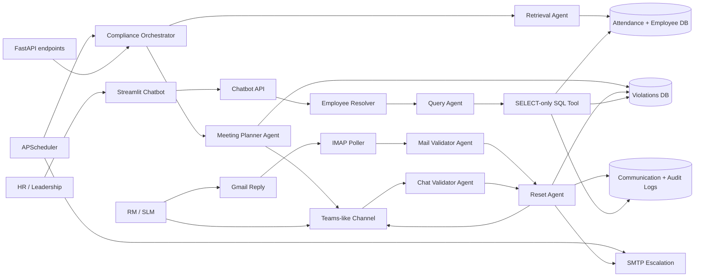

# RTO Compliance

RTO Compliance is a multi-agent workflow for monitoring return-to-office attendance, opening and tracking policy violations, collecting reporting-manager justifications, escalating overdue cases through email, and providing read-only compliance analytics through a natural-language chatbot.

The project combines FastAPI, the OpenAI Agents SDK, SQLite, APScheduler, Gmail SMTP/IMAP, an in-app Teams-like collaboration interface, and a Streamlit analytics UI.

## Key capabilities

- Evaluates weekly and monthly attendance against configurable policy rules.
- Creates a violation only when an employee is non-compliant.
- Opens a private Teams-like channel for the employee, RM, SLM, and compliance bot.
- Sends repeated reminders until a satisfactory response is received.
- Escalates unresolved cases by email to RM and SLM, with Employee and HR in CC.
- Reads Gmail replies through IMAP and validates that the sender is the assigned RM or SLM.
- Uses LLM validators to classify responses as `SATISFACTORY`, `UNSATISFACTORY`, or `PENDING`.
- Resolves accepted cases across both channels:
  - Email approval updates and closes the Teams channel.
  - Teams approval sends a resolution email.
- Keeps communication and audit records in SQLite.
- Provides an authorized, read-only natural-language analytics chatbot.
- Resolves exact, partial, and slightly misspelled employee names to SAP IDs.
- Presents up to five clickable employee choices when a name is ambiguous.

## Architecture



## End-to-end workflow

1. A scheduled job or API request starts a compliance check for an employee.
2. The Retrieval Agent loads the employee and attendance summary.
3. Compliant employees are recorded in the audit log and require no action.
4. For a non-compliant employee, the Meeting Planner Agent:
   - creates a violation;
   - creates a Teams-like channel;
   - adds Employee, RM, SLM, and the bot;
   - posts the violation summary and justification request.
5. The scheduler continues Teams reminders while the violation is active.
6. When the escalation interval expires, an email is sent to RM and SLM, with Employee and HR in CC.
7. The RM/SLM can respond through Teams or the tracked email thread.
8. The relevant validator assesses the justification.
9. A satisfactory verdict with confidence of at least `0.7` invokes the Reset Agent.
10. The violation becomes `RESET`, reminders stop, and both communication channels receive the resolution.

## Agents

| Agent | Responsibility |
|---|---|
| Retrieval Agent | Fetches employee attendance and returns a structured compliance result. |
| Meeting Planner Agent | Creates the violation and Teams-like collaboration channel. |
| Chat Validator Agent | Evaluates RM/SLM justifications submitted through chat. |
| Mail Validator Agent | Evaluates authorized RM/SLM replies from an email thread. |
| Reset Agent | Closes an accepted violation and records the decision. |
| Query Agent | Converts authorized natural-language analytics questions into safe SQL. |
| Email Planner Agent | Agent-tool path for composing and recording email escalation. |

The orchestrator calls agents in a deterministic order rather than relying on autonomous handoffs.

## Technology stack

| Layer | Technology |
|---|---|
| API | FastAPI, Uvicorn |
| Agent framework | OpenAI Agents SDK |
| Model configuration | OpenAI API via `OPENAI_MODEL` |
| Database | SQLite |
| Scheduling | APScheduler |
| Outbound email | Gmail SMTP |
| Inbound email | Gmail IMAP |
| Collaboration UI | FastAPI-served HTML/JavaScript Teams-like interface |
| Analytics UI | Streamlit |
| Validation models | Pydantic |

## Project structure

```text
rto_compliance_bot/
├── app/
│   ├── agents/
│   │   ├── orchestrator.py       # Main compliance and response workflows
│   │   ├── retrieval.py          # Attendance retrieval agent
│   │   ├── meeting_planner.py    # Violation/channel creation agent
│   │   ├── chat_validator.py     # Chat justification validator
│   │   ├── mail_validator.py     # Email justification validator
│   │   ├── reset.py              # Resolution agent
│   │   ├── query.py              # Natural-language query agent
│   │   ├── email_planner.py      # Escalation email agent
│   │   ├── schemas.py            # Structured agent outputs
│   │   └── tools_registry.py     # OpenAI function-tool wrappers
│   ├── api/
│   │   ├── main.py               # FastAPI application
│   │   ├── scheduler.py          # Compliance, reminder, escalation, IMAP jobs
│   │   └── routers/              # Compliance, chat, chatbot, webhook routes
│   ├── db/
│   │   ├── database.py           # SQLite connection helpers
│   │   └── schema.sql            # Database schema
│   ├── tools/
│   │   ├── attendance.py         # Compliance calculation
│   │   ├── violation.py          # Violation lifecycle and audit logging
│   │   ├── chat_tool.py          # Teams-like channels/messages
│   │   ├── email_tool.py         # SMTP and email templates
│   │   ├── email_inbox.py        # IMAP reply polling/correlation
│   │   └── query.py              # Safe SQL and employee resolution
│   └── ui/
│       ├── chat_ui.html           # Teams-like collaboration interface
│       ├── chatbot_app.py         # Streamlit analytics chatbot
│       └── assests/               # UI logos (directory name retained as-is)
├── scripts/
│   ├── init_db.py                # Initialize all SQLite tables
│   ├── seed_data.py              # Demo employees and attendance
│   └── run_local.bat             # Basic Windows launcher
├── tests/
├── DEMO_RECORDING_GUIDE.md       # Detailed presentation walkthrough
├── requirements.txt
└── README.md
```

## Prerequisites

- Python 3.10 or newer.
- An OpenAI API key.
- Optional Gmail account and App Password for real email delivery and reply ingestion.
- PowerShell, Command Prompt, Bash, or another terminal.

## Installation

### Windows PowerShell

```powershell
python -m venv venv
.\venv\Scripts\Activate.ps1
pip install -r requirements.txt
Copy-Item .env.example .env
```

### macOS/Linux

```bash
python3 -m venv venv
source venv/bin/activate
pip install -r requirements.txt
cp .env.example .env
```

Edit `.env` and add the required configuration. Never commit `.env` or real credentials.

## Configuration

| Variable | Required | Default | Purpose |
|---|---:|---|---|
| `OPENAI_API_KEY` | Yes | Empty | Authenticates model and agent requests. |
| `OPENAI_MODEL` | No | `gpt-4o-mini` | Model used by all agents. |
| `DB_PATH` | No | `rto.db` | SQLite database path. |
| `APP_PORT` | No | `8000` | Intended API port setting. Pass the same port to Uvicorn. |
| `GMAIL_USER` | For real email | Empty | Gmail account used for SMTP and IMAP. |
| `GMAIL_APP_PASSWORD` | For real email | Empty | Gmail App Password. |
| `GMAIL_IMAP_ENABLED` | No | `true` | Enables inbox polling when Gmail credentials exist. |
| `EMAIL_POLL_SECONDS` | No | `30` | Gmail inbox polling frequency. |
| `SLA_HOURS` / `SLA_MINUTES` | No | `24` / `0` | Legacy fallback escalation interval. |
| `TEAMS_REMINDER_HOURS` / `MINUTES` | No | SLA values | Teams reminder interval. Minutes override hours. |
| `EMAIL_REMINDER_HOURS` / `MINUTES` | No | SLA values | Email escalation/repeat interval. Minutes override hours. |
| `API_BASE` | No | `http://localhost:8000/api/v1` | FastAPI base URL used by Streamlit. |

When Gmail credentials are absent, outbound messages use a console mock and IMAP polling does nothing.

Recommended local demo settings:

```env
SLA_MINUTES=1
TEAMS_REMINDER_MINUTES=1
EMAIL_REMINDER_MINUTES=1
EMAIL_POLL_SECONDS=10
GMAIL_IMAP_ENABLED=true
```

Use hour-based production-like intervals outside demos.

## Database initialization

Initialize and seed a new database:

```powershell
python scripts/init_db.py
python scripts/seed_data.py
```

Both scripts are idempotent for existing records because the schema uses `IF NOT EXISTS` and seed inserts use `INSERT OR IGNORE`.

To create a clean database, stop all running application processes and preserve the old file first:

```powershell
if (Test-Path .\rto.db) {
    $stamp = Get-Date -Format "yyyyMMdd-HHmmss"
    Move-Item .\rto.db ".\rto-backup-$stamp.db"
}
python scripts/init_db.py
python scripts/seed_data.py
```

## Seeded demo data

- Seven employees with weekly/monthly policies.
- Thirty-five days of weekday attendance.
- `E007` is deterministically non-compliant with zero present days.
- Authorized chatbot accounts:
  - `hr@example.com`
  - `leadership@example.com`
  - `admin@example.com`

Primary end-to-end demo employee:

| Field | Value |
|---|---|
| SAP ID | `E007` |
| Employee | Abhishek Tiwary |
| Employee email | `abhitiwary0001@gmail.com` |
| RM email | `pandahai477@gmail.com` |
| Policy | `WEEKLY` — 3 required days |

## Running the application

Start the API and scheduler:

```powershell
uvicorn app.api.main:app --reload --port 8000
```

In a second terminal, start Streamlit:

```powershell
streamlit run app/ui/chatbot_app.py --server.port 8501
```

Open:

- API health: <http://localhost:8000/api/v1/health>
- Swagger API docs: <http://localhost:8000/docs>
- Teams-like UI: <http://localhost:8000/api/v1/chat>
- Analytics chatbot: <http://localhost:8501>

## Quick end-to-end example

Trigger the deterministic employee check from PowerShell:

```powershell
$body = @{ emp_sapid = "E007"; policy_type = "WEEKLY" } | ConvertTo-Json
Invoke-RestMethod `
  -Method Post `
  -Uri "http://localhost:8000/api/v1/compliance/check" `
  -ContentType "application/json" `
  -Body $body | ConvertTo-Json -Depth 8
```

Then:

1. Open the Teams-like UI.
2. Sign in as the employee or assigned RM.
3. Open the newest channel.
4. Submit a specific justification as RM, including reason, dates, and approval reference.
5. Observe the validator response and resolved channel.
6. Open the chatbot, sign in as `hr@example.com`, and ask for the latest violations.

For the complete recording-ready walkthrough, see [DEMO_RECORDING_GUIDE.md](DEMO_RECORDING_GUIDE.md).

## API overview

All application endpoints use the `/api/v1` prefix except `/`.

| Method | Endpoint | Purpose |
|---|---|---|
| `GET` | `/api/v1/health` | Health check. |
| `POST` | `/api/v1/compliance/check` | Run one employee compliance check. |
| `POST` | `/api/v1/compliance/bulk_check` | Run checks for all employees in a policy. |
| `POST` | `/api/v1/compliance/sla_sweep` | Manually process due email escalations. |
| `GET` | `/api/v1/violations` | List/filter violations. |
| `GET` | `/api/v1/violations/{violation_id}` | Return violation and communication history. |
| `GET` | `/api/v1/chat` | Serve the Teams-like UI. |
| `GET` | `/api/v1/chat/channels` | List channels visible to an email address. |
| `GET` | `/api/v1/chat/channels/{id}/messages` | Read channel messages. |
| `GET` | `/api/v1/chat/channels/{id}/info` | Read channel members and linked violation. |
| `POST` | `/api/v1/chat/send` | Post a channel message and validate RM/SLM replies. |
| `POST` | `/api/v1/chatbot/query` | Run an authorized natural-language analytics query. |
| `POST` | `/api/v1/webhooks/email_reply` | Manually submit an email reply for validation. |
| `POST` | `/api/v1/webhooks/slack` | Compatibility endpoint for Slack-style events. |

Use <http://localhost:8000/docs> for interactive request schemas.

## Chatbot behavior

The Streamlit chatbot is intended for allow-listed HR and leadership users.

Features include:

- Blue/purple/white dashboard and responsive branding.
- Suggested prompts as clickable chat options.
- Session metrics and clear-conversation control.
- SQL disclosure through the **SQL used** expander.
- Employee resolution before SQL generation:
  - exact SAP ID;
  - employee email;
  - full name;
  - partial name;
  - minor spelling mistakes.
- Up to five clickable matches for ambiguous names.

The Query Agent may execute only `SELECT` statements. The SQL tool rejects mutation keywords and multiple statements, and automatically applies a result limit when one is absent.

## Email processing

Outbound mail uses `smtp.gmail.com:465`. Inbound replies use `imap.gmail.com:993`.

Each new escalation subject includes:

```text
[RTO ESCALATION] [RTO-ID:<violation-id>] ...
```

The IMAP poller:

1. Scans recent messages with `RTO ESCALATION` in the subject.
2. Correlates by `RTO-ID`; older threads can fall back to an employee SAP ID in the subject.
3. Deduplicates messages using their `Message-ID` and the audit log.
4. Rejects replies from senders who are not the assigned RM or SLM.
5. Sends the validation outcome in the same thread using `In-Reply-To` and `References` headers.

## Database model

| Table | Purpose |
|---|---|
| `employees` | Employee contacts, hierarchy, policy, and active status. |
| `attendance` | Daily attendance hours and present/absent status. |
| `violations` | Compliance periods, shortfalls, lifecycle status, and reminder timestamps. |
| `communication_log` | Inbound/outbound Teams and email messages with verdict data. |
| `audit_log` | System actions, actors, and operational details. |
| `authorized_users` | Allow-listed chatbot users and roles. |
| `channels` | Teams-like channel metadata and resolution status. |
| `channel_members` | Channel participants and roles. |
| `messages` | Teams-like conversation messages and metadata. |

Violation lifecycle:

```text
OPEN → TEAMS_NOTIFIED → EMAIL_ESCALATED → RESET
```

The violation may move directly from `TEAMS_NOTIFIED` to `RESET` when Teams contains a satisfactory response.

## Verification and testing

Compile the main Python modules:

```powershell
python -m compileall app scripts
```

Perform a smoke check:

1. Initialize and seed a temporary or clean database.
2. Start FastAPI and verify `/api/v1/health`.
3. Trigger `E007` through `/api/v1/compliance/check`.
4. Confirm a channel and active violation were created.
5. Submit a detailed RM response through Teams or the email webhook.
6. Confirm the violation status becomes `RESET`.
7. Sign in to Streamlit as `hr@example.com` and run a read-only query.

The current `tests/test_compliance.py` is a legacy smoke-test script and should be updated to the latest `violations` schema before being treated as an automated regression suite.

## Security and production considerations

This repository is suitable for local development and demonstrations. Before production use:

- Replace allow-listed email-only chatbot access with real authentication and authorization.
- Replace the in-app Teams-like UI with Microsoft Graph/Teams integration if required.
- Move from SQLite to a managed relational database with migrations and concurrency controls.
- Store secrets in a secret manager instead of local `.env` files.
- Use OAuth for Gmail/enterprise mail rather than long-lived App Passwords where possible.
- Validate and sanitize all external webhook inputs.
- Add request authentication, rate limiting, CSRF protections, and restrictive CORS settings.
- Add comprehensive unit, integration, and end-to-end tests.
- Review retention, privacy, and access policies for employee attendance and justification data.
- Add human review for sensitive or high-impact automated decisions.

## Troubleshooting

### `no such table: attendance`

Run:

```powershell
python scripts/init_db.py
python scripts/seed_data.py
```

Confirm `DB_PATH` is the same for both commands and the API process.

### Schema syntax error near a column

Use the repository version of `app/db/schema.sql`, then initialize a fresh database. SQLite does not automatically repair a partially initialized or incompatible schema.

### No Teams-like channel appears

- Check the FastAPI console for an OpenAI/tool error.
- Confirm the employee exists and is active.
- Ensure the employee is non-compliant for the calculated period.
- Refresh the Teams-like UI.

### Escalation email is not sent

- Verify the violation is due based on the configured interval.
- Trigger `/api/v1/compliance/sla_sweep` after the due time.
- Confirm Gmail credentials and App Password.
- Check the API console for `EMAIL_FAILED`.

### Gmail reply is not processed

- Reply from the assigned RM or SLM address.
- Keep the tracked subject and `RTO-ID` intact.
- Confirm IMAP polling is enabled.
- Allow at least one poll interval.
- Check the API console for an email-polling error.

### Chatbot sign-in fails

- Seed the database.
- Use an address from `authorized_users`.
- Confirm Streamlit can reach `API_BASE`.
- Confirm the FastAPI health endpoint is available.

### Employee name is not matched

- Ensure employee records are seeded and active.
- Try a complete name, employee email, or SAP ID.
- If multiple choices are shown, click the intended employee.

## Demo guide

For a timed presentation script, exact commands, narration, browser layout, and recovery checklist, use [DEMO_RECORDING_GUIDE.md](DEMO_RECORDING_GUIDE.md).

## License

No license file is currently included. Add an appropriate license before distributing or reusing the project outside its intended organization.
